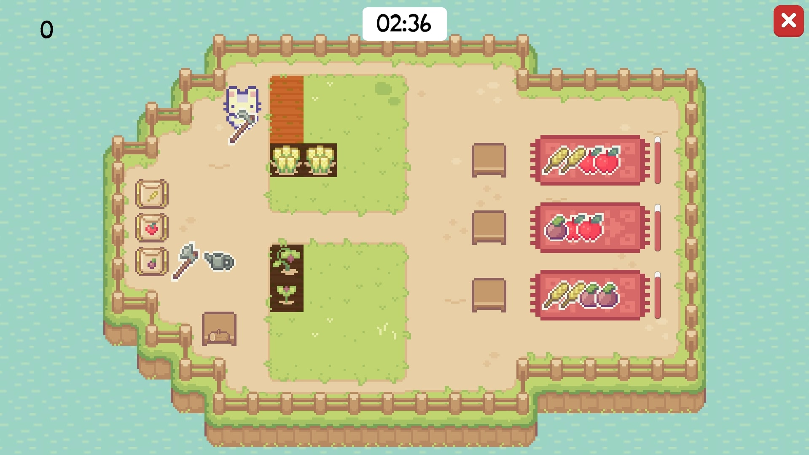

# Village market

Village market - это компьютерная игра, в которой нужно выращивать овощи и фрукты,
собирать урожай и выполнять задания, играя за кота-садовода.

[Скачать игру](https://drive.google.com/file/d/1vhKl5hGbINnAX770ij-wMiKyVLgTXwrg/view?usp=drive_link)

## Об игре
Цель игры - набрать как можно больше очков, выращивая овощи и собирая заказы.
У каждого заказа есть свое время на выполнение, так что игроку стоит поторопиться.
В игре есть обучение, в котором игрок знакомится с управлением и правилами игры. 
После прохождения обучения он готов приступить к настоящей игре с заданиями на время.
В основном меню есть таблица лидеров по количеству набранных очков.

## Стек
- Unity
- C# 

## Команда
Игра сделана студентами 1 курса ФИИТ УрФУ.
Над проектом работали:
- Аптер Владимир
- Юрий Ромашов
- Павловская Елизавета

## Контакты

- telegram: [@VladimirApter](https://t.me/VladimirApter)
- email: [vova.apter@yandex.ru](mailto:vova.apter@yandex.ru)

village_market 2024.